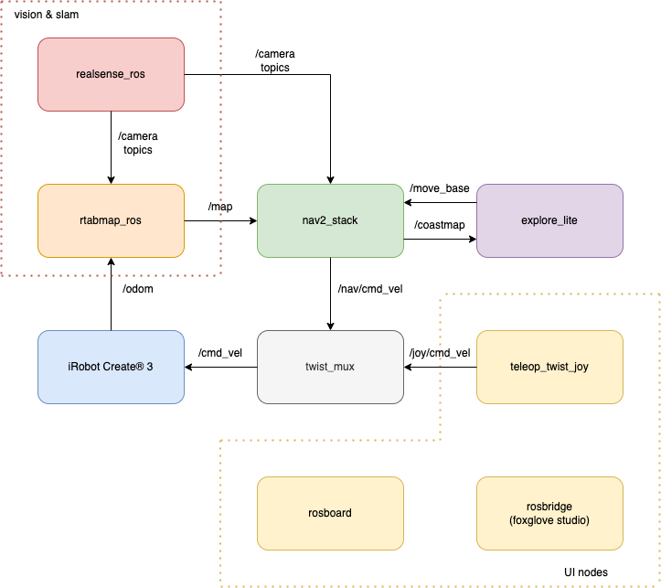
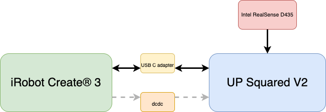

# UP Create® 3

Documentation about UP Create® 3, how to setup, add-ons and how-to tutorials.

## Setup

- [Get Started](./docs/get_started.md)
- [Assembly instructions](./assembly_instructions/01_preparation.md)
- [UP Squared v2 setup](./docs/up2v2_setup/up2v2_setup.md)

## ROS2
- [UP Create® 3 architecture](./docs/upcreate3/ros2_intro.md)
- [ROS2 installation](./docs/up2v2_setup/ros2.md)
- [setup all UP Create® 3 ROS2 packages](./docs/upcreate3/prepare_ros2_environment.md)

## Utilities
- [VScode](./docs/utilities/vscode.md), an easy to use IDE to develop software when you attach keyboard and monitor to your UP Create® 3
- [Code Server](./docs/utilities/code_server.md), develop software on UP Create® 3 with zero installation on client side
- [Joypad](./docs/utilities/joypad.md), use a joypad to control the robot
- [ROSboard](./docs/utilities/rosboard.md), use a webgui to watch data in Real-Time
- [todo: FoxGlove](./docs/utilities/foxglove.md), a remote interface available on web, linux, macos and windows
- [GitHub CLI](./docs/utilities/github_cli.md), use github on your robot

## Architecture

The following scheme shows robot's architecture

>Copyrights © 2022 G. Bruno gbr1.github.io under MIT License
